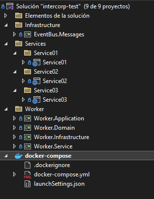

# Intercorp Test - Backend

Este es un proyecto de microservicios desarrollado en .NET 8 que utiliza RabbitMQ como sistema de mensajería. La arquitectura está diseñada para ser escalable y eficiente, facilitando la comunicación asíncrona entre los servicios. Este enfoque permite una mayor flexibilidad y robustez en la gestión de eventos y procesos dentro de la aplicación.

## Instrucciones para Ejecutar el Proyecto

1. **Levantar los Servicios**  
   Ejecuta `docker-compose up` para iniciar el proyecto. Esto creará varios servicios, incluyendo la base de datos en PostgreSQL.

2. **Conexión a la Base de Datos**  
   Puedes conectarte a la base de datos utilizando tu IDE preferido, como DBeaver. Configura la conexión con los siguientes parámetros:

   - **Host:** localhost
   - **Port:** 5432
   - **Database:** postgres
   - **Username:** postgres
   - **Password:** pass123

### Estructura del proyecto

